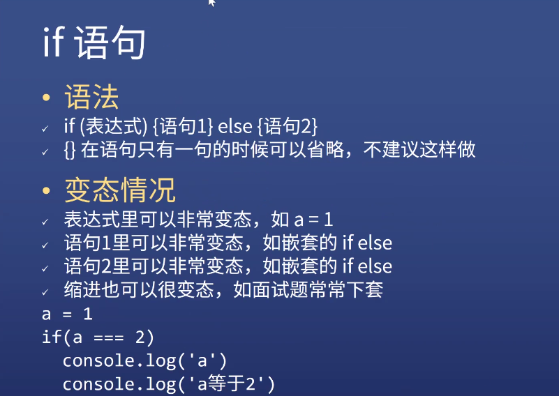

# JS 基本语法

## JS 语法

### 表达式与语句

1. 表达式

   - 1 + 2 表达式的**值**为 3
   - add(1,2)表达式的值为函数的**返回值**（返回值只针对函数）
   - console.log 表达式的值为函数本身
   - console.log(3)表达式的值为多少？ 是 undefined

2. 语句

   - var a = 1 是一个语句

3. 二者的区别
   - 表达式一般都有值，语句可能有也可能没有
   - 语句一般会改变环境（声明，赋值）
   - 上面两句话不是绝对的

### 一些注意点

1. 大小写敏感
2. 大部分回车空格没有实际意义
3. 只有 return 后面不能加回车

### 标识符

1. 第一个字符可以是 Unicode 字母或\$或\_（下划线最多两个，多了会挨揍）
2. 后面的字符，除了上述还可以用数字
3. 变量名是标识符

### 注释

1. // 单行
2. /\* \*/ 多行
3. 不好的注释
   - 把代码翻译成中文
   - 过时的注释
   - 发泄不满的注释
4. 好的注释
   - 踩坑注释
   - 为什么代码会写得这么奇怪，遇到什么 bug

### 区块 block {}

{
a = 1;
b = 2;
}

## if...else...

### 语法

1. if(表达式){语句 1}else{语句 2}
   - 语句只有 1 句，可以省略{}
2. 变态情况

```javascript
a = 1;
if (a === 2) 
  console.log("a");
  console.log("a 等于 2");
```

- 省略{}，if 只管下面第一句,结果为 a，后面的缩进是无效的

  
_图片来自杭州饥人谷教程_

### 程序员戒律

1. 不能相信人类
2. 使用最没有歧义的写法

### 最推荐的写法

1. 最推荐

```javascript
if (表达式) {
  语句;
} else if (表达式) {
  语句;
} else {
  语句;
}
```

2. 次推荐的写法

```javascript
function fn() {
  if (表达式) {
    return 表达式;
  }
  if (表达式) {
    return 表达式;
  }
  return 表达式;
}
```

### switch 语句

1. 语法

```javascript
switch (参数) {
  case 条件1:
    语句1;
    break; //不写break，执行了也不停止，继续向下执行
  case 条件2:
    语句2;
    break;
  default:
}
```

### 问号冒号表达式

- 表达式 1 ? 表达式 2 : 表达式 3
- 简化的 if-else 语句

### && 短路逻辑

- A && B && C && D
- 取第一个假值或 D（取到假就停，后面不执行）
- 并不会取 true/false

### || 短路逻辑

- A || B
- 取第一个真值或 B（取到真就停，后面不执行）
- 不取 true/false
- A = A || B （B 是保底值）

### 总结

  
_图片来自杭州饥人谷教程_

## while 循环和 for 循环

### while 循环

1. 语法

   - while(表达式){语句}
   - 判断表达式的真假
   - 当表达式为真，执行语句，执行完再判断表达式真假
   - 当表达式为假，跳出，执行后面的语句

2. do...while 用的不多，自己了解

```javascript
let i = 0;
while (i < 10) {
  console.log(i);
  i++;
}
```

3. 死循环

```javascript
let a = 0.1;
while (a !== 1) {
  console.log(a);
  a = a + 0.1;
}
```

浮点数的计算不精确，a 不能精确的等于 1

### for 循环

- 一般用 for 不用 while

1. 语法

```javascript
for (语句1; 表达式2; 语句3) {
  循环体;
}
```

- 先执行语句 1
- 然后判断表达式 2（判断条件）
- 如果为真，执行循环体，然后执行语句 3
- 如果为假，直接退出循环体，执行后面的语句

2. 变态例子
   var/let

```javascript
for (var i = 0; i < 5; i++) {
  setTimeout(() => {
    //setTimeout作用：过一会执行，肯定在for循环之后
    console.log(i);
  }, 0);
}
```

用 var ---- 打印 5 个 5

```javascript
for (let i = 0; i < 5; i++) {
  setTimeout(() => {
    //setTimeout作用：过一会执行，肯定在for循环之后
    console.log(i);
  }, 0);
}
```

var 换成 let ---- 打印 01234

### break 和 continue

1. break 退出当前循环（退出离他最近的一层）

```javascript
for (var i = 0; i < 10; i++) {
  if (i % 2 === 1) {
    console.log(i);
    break;
  }
}
```

打印 1

2. continue 跳过本次循环

```javascript
for (var i = 0; i < 10; i++) {
  if (i % 2 === 1) {
    console.log(i);
    continue;
  }
}
```

打印 02468

### label

- 用的很少，面试会考（概率 5%）

1. 语法

```javascript
foo: {
  //foo是随便一个标识符
  console.log(1);
  break foo;
  console.log("本行不会输出");
}
console.log(2);
```

2. 面试

```javascript
{
  a: 2;
}
```

上面这个东西就是 label，值是 1
